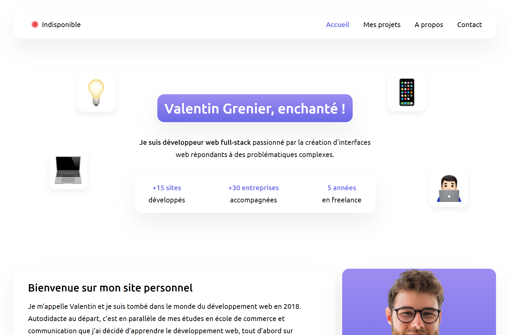

# Bienvenue sur le dépôt de mon portfolio

Ce dépôt contient tous les fichiers de mon portfolio, actuellement consultable sur l'adresse [valentingrenier.fr](https://valentingrenier.fr) et hébergé sur mon serveur web.

Ce projet est destiné à évoluer dans le temps au fur et à mesure de ma formation "Développement Web et Web Mobile" chez l'école O'Clock. Pour le moment, j'ai choisi de créer mon portfolio à la main, sans frameworks, afin d'avoir un MVP fonctionnel et joli.

## A propos du projet

<div align="center">
  

  <p align="center">
    <small>Mon portfolio, l'espace où je publie mes réalisations professionnelles et personnelles</small>
  </p>
</div>

### Roadmap

- [x] Landing page avec HTML, CSS et Javascript
- [ ] Refonte landing page -> TailwindCSS
- [ ] Ajout pages supplémentaires
  - [ ] Projets
  - [ ] A propos
- [ ] Mise à niveau -> Laravel
  - [ ] Création d'un back office
  - [ ] Ajout page individuelle pour chaque projet
  - [ ] Ajout page contact avec formulaire


### Visualiser le projet en local

Voici comment obtenir une copie local de mon projet. Il suffit de suivre les étapes suivantes.

#### Installation

Il suffit simplement de cloner ce dépôt dans un dossier sur votre machine.

##### HTTPS

```git
git clone https://github.com/valentin-grenier/portfolio.git
```

#### SSH

```git
git clone git@github.com:valentin-grenier/portfolio.git
```

### Contribuer à ce projet

Les contributions sont les bienvenues ! Si vous avez une quelconque suggestion, voici la procédure à suivre. N'hésitez pas à donner une étoile à ce projet si vous l'appréciez 🙂

1. Créer un fork
2. Créez votre branche (`git checjout -b feature/nomdelafeature`)
3. Commit de votre code (`git commit -m 'Ajout de fonctionnalités'`)
4. Push sur la branche (`git push origin feature/nomdelafeature`)
5. Ouverture d'une Pull Request

### Contact

LinkedIn : [Valentin Grenier](https://www.linkedin.com/in/valentin-grenier/)

Twitter : [@valentingrn](https://twitter.com/valentingrn)

Lien du projet : [https://github.com/valentin-grenier/portfolio](https://github.com/valentin-grenier/portfolio)
